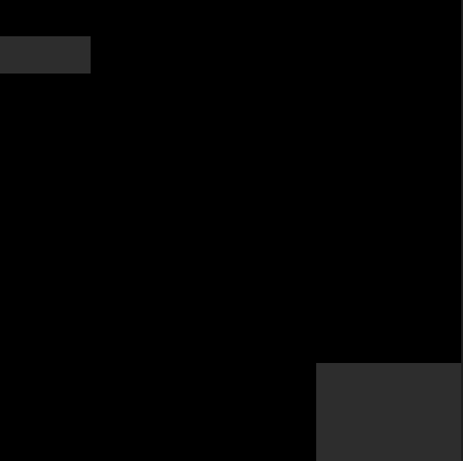
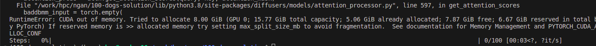

# How to generate 100 dogs at distinct locations using diffusion model?

# Introduction

To answer the question “How to generate 100 dogs at distinct locations using diffusion model?”, we need to consider the following aspects:

- Distinct location
    
    The problem of object generation at distinct locations can be considered as a Layout-to-image generation task, where each annotation consists of the top-left point, bottom-right point, and class, corresponding to each coordinate.
    
- Conditional image generation: For the Layout-to-image problem, the current state-of-the-art models all base on the latent diffusion model. ([https://paperswithcode.com/task/layout-to-image-generation](https://paperswithcode.com/task/layout-to-image-generation))
- Quantity: To work with the COCO dataset, the task can be regarded as generating images containing multiple objects (dogs). With 100-dogs generation task, the training and sampling process will be the same with customize datasets

# Popular approach for Diffusion-based Layout-to-Image generation

- Latent Diffusion model: [https://arxiv.org/abs/2112.10752](https://arxiv.org/abs/2112.10752) https://github.com/CompVis/stable-diffusion
- Layout Diffusion: https://github.com/zgctroy/layoutdiffusion

# Dataset

100-dogs generation at distinct locations problem may require specialized datasets. But right now we cannot annotate 100 dogs for each image, so we use COCO dataset. COCO is a large-scale object detection, segmentation, and captioning dataset, including data about human, animals, stuffs,… and dogs of courses with its respective bounding box and label. In this implement, I only use tiny COCO from https://github.com/chongruo/tiny-coco, and have some data preprocessing to convert to the .jsonl file format.

# Approach

I propose 2 approach. It is text2img-based method and img2img-based method.

### Text2img method

Annotation information will be embedded by CLIP tokenizer and embedding. Then concat it with prompt embedding, then go to U-net by cross-attention mechanism for new image generation with objects in distinct locations.

# Implementation

### Environment

```python
conda env create -f environment.yaml
conda activate ldm
pip install accelerate
pip install git+https://github.com/huggingface/diffusers
```

### Sampling

Both 2 methods’ models is fine-tuned on pretrained "runwayml/stable-diffusion-v1-5”. I have not completed the training process to obtain the final output checkpoint. Therefore, I will temporarily run the code with stable-diffusion-v1-5 to ensure it could run.

- For text-to-img method:
    - To run
    
    ```python
    python3 src/text2img_sampling.py
    ```
    
    Annotation (bboxes, labels) will be treated as strings, be encoded and concat to the prompt embedding.
    
    ```python
        annotation = ["label_74_bbox_455.98_436.73_58.57_36.36","label_74_bbox_405.44_594.41_76.59_40.23"] #[tl_x, tl_y, br_x, br_y, label (18 is dog in COCO)]
    ```
    
- For img-to-img method:
    - To run

```python
python3 src/img2img_sampling.py
```

I created mask base on the image’s bounding boxes and labels, then encoding it to feed to the denoising step.

```python
mask = create_mask([(0, 40, 100, 80, 18), (350, 400, 510, 510, 18)])
```



### Training

- Text2img training

```python
python3 src/text2img_training.py  \
--pretrained_model_name_or_path "runwayml/stable-diffusion-v1-5"  \
--train_data_dir "./tiny-coco/small_coco" \
--caption_column "custom_annotation" \
--image_column "image" \
--annotation_column "custom_annotation"
```

In this code I do not train CLIP tokenizer and embedding. Since embedding an annotation is difference from normal text encoding, I think we should set CLIP tokenizer and embedding to be trained.

In fact that I do not have enough GPU resources, so I cannot verify if the training script run property. But when I run it, it went to the tqdm step 1 progress.



- Img2img training

I only implement training for text2img method. For the img2img method, the implementation is quite similar, with the only difference being the addition of an extra step to encode the image and create a mask for annotation.